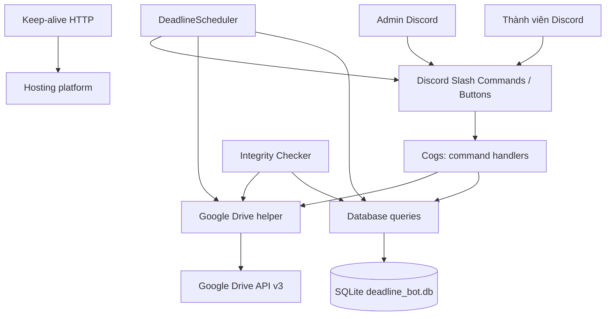
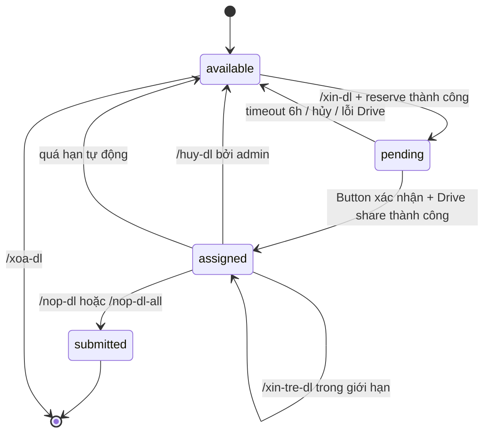

# SRS — Bot Giao Deadline

| Thuộc tính | Giá trị |
|---|---|
| Sản phẩm | Discord Bot Giao Deadline |
| Phiên bản tài liệu | 1.0 |
| Trạng thái | As-is — mô tả theo source hiện tại |
| Ngày cập nhật | 08/08/2026 |
| Ngôn ngữ giao tiếp | Tiếng Việt |
| Nền tảng chính | Discord, SQLite, Google Drive API v3 |

## 1. Mục đích tài liệu

Tài liệu này đặc tả các yêu cầu, quy tắc nghiệp vụ, mô hình dữ liệu, thuật toán và cơ chế vận hành của bot. Mục tiêu là để thành viên, quản lý, developer và người triển khai có cùng một cách hiểu về:

- cách deadline được tạo, chọn, giữ chỗ, giao, nộp, hủy và trả về kho;
- cách bot tính thời hạn theo từng vị trí công việc;
- cách bot cấp/thu hồi quyền Google Drive;
- cách scheduler nhắc hạn, xử lý quá hạn và tự kiểm tra dữ liệu;
- các điều kiện triển khai, bảo mật, khôi phục lỗi và giới hạn hiện tại.

Tài liệu phản ánh **hành vi đang có trong code**, không phải danh sách tính năng mong muốn trong tương lai. Những điểm chưa hoàn chỉnh được ghi ở mục [Giới hạn và vấn đề cần lưu ý](#18-giới-hạn-và-vấn-đề-cần-lưu-ý).

## 2. Phạm vi sản phẩm

### 2.1. Trong phạm vi

Bot hỗ trợ quản lý deadline theo từng Discord Server (Guild), gồm:

- quản lý kho chapter theo truyện và vị trí edit;
- thành viên đăng ký email để nhận quyền Google Drive;
- thành viên xin 1–2 chapter và xác nhận bằng button;
- tính hạn nộp tự động theo loại vị trí;
- theo dõi trạng thái `available`, `pending`, `assigned`, `submitted`;
- nộp từng chapter hoặc toàn bộ chapter đang nhận;
- xin gia hạn tối đa 12 giờ;
- nhắc hạn ở mốc 6 giờ và 3 giờ;
- tự động trả chapter quá hạn về kho;
- cấp, kiểm tra và thu hồi quyền Google Drive;
- admin thêm, hủy, xóa, reset deadline;
- thống kê, nhật ký thao tác và thông báo lỗi vận hành.

### 2.2. Ngoài phạm vi

- Bot không xử lý nội dung chỉnh sửa truyện, upload file hoặc review chất lượng bản edit.
- Bot không phải hệ thống chấm công, tính lương hoặc quản lý nhân sự.
- Bot không lưu file Google Drive; chỉ thao tác permission của file/folder được cung cấp.
- Bot không có giao diện web nghiệp vụ; HTTP server trong `keep_alive.py` chỉ trả health text `Bot is running!`.

## 3. Tổng quan sản phẩm

Bot chạy dưới dạng một process Python, kết nối Discord qua `discord.py`, lưu dữ liệu bằng SQLite qua `aiosqlite` và gọi Google Drive API bằng service account. Khi khởi động, bot nạp các Cog, khởi tạo/migrate database, đồng bộ slash command và bật hai vòng lặp nền:

1. `check_deadlines`: chạy mỗi 10 phút để dọn `pending` hết hạn, nhắc deadline sắp đến hạn và trả deadline quá hạn về kho.
2. `check_integrity`: chạy mỗi 30 phút để sửa dữ liệu gia hạn vượt giới hạn và kiểm tra quyền Drive của các assignment đang hoạt động.

### 3.1. Kiến trúc logic



### 3.2. Module chính

| Module | Trách nhiệm |
|---|---|
| `bot.py` | Entry point, nạp Cog, init DB, sync command, khởi động scheduler |
| `config.py` | Đọc environment variables, định nghĩa role, quyền admin và các hằng số thời gian |
| `cogs/` | Xử lý slash command, modal và button của Discord |
| `database/db.py` | Kết nối SQLite, tạo bảng, migration và index |
| `database/queries.py` | Transaction, truy vấn deadline, log, email, setting và self-check |
| `utils/chapter_helper.py` | Parse/chuẩn hóa chapter, truyện và ngoại truyện |
| `utils/time_helper.py` | Tính và hiển thị thời gian theo UTC+7 |
| `utils/google_drive.py` | Parse link, cấp/kiểm tra/thu hồi permission và chuẩn hóa lỗi Drive |
| `utils/scheduler.py` | Nhắc hạn, auto-return quá hạn và gọi self-check |
| `utils/integrity_checker.py` | Sửa legacy extension và audit quyền Drive |
| `utils/admin_notifier.py` | Ghi nhật ký admin vào private thread và thông báo role có deadline mới |
| `utils/embed_builder.py` | Tạo Discord Embed cho preview, kết quả, danh sách và dashboard |
| `keep_alive.py` | HTTP health endpoint chạy trong daemon thread |

## 4. Actor và quyền

### 4.1. Actor

| Actor | Mô tả |
|---|---|
| Thành viên | Đăng ký email, xin deadline, xem, nộp và xin gia hạn deadline của chính mình |
| Admin/Quản lý | Quản lý kho, hủy assignment, xem thống kê/email, cấu hình server và reset dữ liệu |
| Discord | Cung cấp identity, Guild, Role, command interaction, DM và channel/thread |
| Google Drive service account | Thực hiện thao tác permission trên file/folder |
| Scheduler | Actor hệ thống chạy background task tự động |

### 4.2. Quy tắc xác định admin

`is_admin()` cho phép qua nếu thỏa **một trong các** điều kiện sau, theo thứ tự:

1. Người dùng là chủ Discord Server.
2. Người dùng có quyền Discord `Administrator`.
3. Người dùng có Role ID được cấu hình riêng cho Guild bằng `/cauhinh`.
4. User ID, Role ID hoặc tên Role nằm trong `ADMIN_USER_ID`/`ADMIN_ROLE_ID` của `.env`.

Các giá trị admin trong `.env` có thể phân cách bằng dấu phẩy, chấm phẩy hoặc khoảng trắng; comment inline sau dấu `#` được bỏ qua.

### 4.3. Thuật ngữ

| Thuật ngữ | Ý nghĩa |
|---|---|
| Guild | Một Discord Server; dữ liệu nghiệp vụ được phân vùng theo `guild_id` |
| Pool/kho | Tập deadline đang ở trạng thái `available` |
| Assignment | Một deadline đã được giao cho thành viên |
| Batch | Nhóm 2 deadline được nhận trong cùng một request và dùng chung hạn |
| Drive link/key | URL hoặc Drive ID; key được dùng để nhận diện cùng một file/folder qua nhiều URL |
| Legacy `global` | Dữ liệu từ phiên bản cũ chưa gắn Guild cụ thể |
| Self-check | Tác vụ nền kiểm tra và sửa các bất thường dữ liệu/quyền Drive |

### 4.4. Giả định và phụ thuộc

- User có Discord ID ổn định trong thời gian assignment tồn tại.
- Thành viên cần một email có thể nhận quyền Google Drive trước khi xác nhận deadline.
- Bot được mời vào Guild và có đủ permission Discord cho command, DM, channel và private thread.
- Google service account có thể truy cập các file/folder được nhập vào kho.
- Process chỉ chạy một instance chính trên cùng một database file.
- Hosting có filesystem persistent nếu muốn giữ SQLite database sau khi restart/deploy.

## 5. Quy tắc nghiệp vụ cốt lõi

### 5.0. Functional requirement baseline

| ID | Yêu cầu chức năng | Mức |
|---|---|---|
| FR-01 | Bot phải khởi tạo database, nạp Cog, sync slash command và start scheduler khi online. | Must |
| FR-02 | Bot phải phân quyền admin theo Discord owner/Administrator, cấu hình Guild hoặc environment fallback. | Must |
| FR-03 | Admin phải tạo được deadline theo chapter, truyện, role và Drive link. | Must |
| FR-04 | Thành viên phải xin được tối đa 2 chapter với cơ chế pending/confirm chống tranh chấp. | Must |
| FR-05 | Bot phải cấp, kiểm tra, thu hồi quyền Google Drive và rollback khi cấp quyền thất bại. | Must |
| FR-06 | Thành viên phải xem và nộp một hoặc toàn bộ assignment của chính mình. | Must |
| FR-07 | Thành viên phải xin gia hạn trong ngân sách tối đa 12 giờ, áp dụng đúng cho batch. | Must |
| FR-08 | Scheduler phải dọn pending, nhắc hạn, auto-return quá hạn và chạy self-check. | Must |
| FR-09 | Admin phải hủy, xóa, reset deadline và quản lý email thành viên. | Must |
| FR-10 | Admin phải xem dashboard, quá hạn, lỗi Drive và chi tiết deadline. | Must |
| FR-11 | Admin phải cấu hình channel và role quản lý riêng theo Guild. | Should |
| FR-12 | Process phải có HTTP health endpoint phục vụ hosting keep-alive. | Should |

### 5.1. Các vị trí và cách tính hạn

| Mã | Tên hiển thị | Tốc độ | Công thức hạn | Đơn vị nhắc |
|---|---|---:|---|---|
| `editfull` | Edit Full Manhwa | 2 ngày/chap | `chap_count × 2 ngày` | Từng chap |
| `clean` | Clean Full SFX | 1 ngày/chap | `chap_count × 1 ngày` | Từng chap |
| `type_ko_sfx` | Type không SFX | 2 chap/ngày | `ceil(chap_count × 0.5 ngày)` | Theo ngày |
| `type_sfx` | Type mỗi SFX | 2 chap/ngày | `ceil(chap_count × 0.5 ngày)` | Theo ngày |

Mốc thời gian được tính từ thời điểm hiện tại theo múi giờ Việt Nam UTC+7 và lưu dạng `YYYY-MM-DD HH:MM:SS`.

### 5.2. Chapter và ngoại truyện

- Chapter thường nhập bằng số, ví dụ `10`.
- Ngoại truyện nhập bằng `NT1`, `NT2`, ...; trong DB được lưu bằng số âm: `NT1 → -1`, `NT2 → -2`.
- Danh sách admin hỗ trợ số đơn, dải số và ngoại truyện, ví dụ `1, 2, 5-8, NT1, NT2`.
- Tên truyện được chuẩn hóa Unicode, bỏ zero-width character, gom khoảng trắng và so khớp không phân biệt hoa thường.
- Khi người dùng có cùng số chapter ở nhiều truyện, các lệnh `/nop-dl` và `/xin-tre-dl` yêu cầu nhập thêm `truyen` để tránh chọn nhầm.

### 5.3. Giới hạn nhận deadline

- Một lần gọi `/xin-dl` nhận từ 1 đến 2 chapter.
- Một người không được có chapter ở trạng thái `assigned` hoặc `pending` trước khi xin tiếp.
- Một yêu cầu nhận từ 2 chapter được gắn cùng `batch_id` UUID và dùng chung hạn nộp.
- Một yêu cầu nhận 1 chapter không có `batch_id`.

### 5.4. Thuật toán chọn chapter

Nguồn chọn là các dòng thỏa:

- thuộc Guild hiện tại, đồng thời vẫn bao gồm dòng legacy `global` hoặc `NULL`;
- đúng `role_type`;
- `status = 'available'`;
- không dùng Drive link đang bị tạm tránh do lỗi chia sẻ.

Thuật toán `select_available_deadlines(rows, count)`:

1. Gom các dòng theo tên truyện sau khi chuẩn hóa.
2. Trong mỗi truyện, sắp xếp chapter tăng dần; ngoại truyện được xếp sau chapter thường.
3. Loại chapter trùng trong cùng một truyện.
4. Chọn ngẫu nhiên tối đa `count` truyện khác nhau.
5. Lấy chapter nhỏ nhất của mỗi truyện đã chọn.
6. Nếu số truyện ít hơn số chapter cần nhận, lấy tiếp các chapter nhỏ tiếp theo từ các truyện đã chọn.

Vì giới hạn hiện tại là tối đa 2 chapter, trường hợp phổ biến là: có từ 2 truyện thì chọn 1 chapter từ 2 truyện khác nhau; chỉ có 1 truyện thì chọn 2 chapter nhỏ nhất của truyện đó.

### 5.5. Drive link bị lỗi

- Link Drive được quy về key ổn định theo Drive ID; các URL khác query string nhưng cùng ID được xem là một link.
- Lỗi chia sẻ không tạm thời làm các chap thuộc link bị loại khỏi lần chọn tiếp theo trong 4 giờ kể từ lúc ghi nhận lỗi; hết thời gian này, chap được cho nhận lại bình thường.
- Lỗi tạm thời như rate limit, quota, timeout, 429/5xx không đưa link vào blacklist.
- Thông báo gửi cho người dùng được rút gọn, không đẩy raw Google API error hoặc stack trace lên Discord.

## 6. Vòng đời deadline

### 6.1. Các trạng thái

| Trạng thái | Ý nghĩa |
|---|---|
| `available` | Chapter còn trong kho, chưa có người nhận |
| `pending` | Đã giữ chỗ cho một user, đang chờ user bấm xác nhận |
| `assigned` | Đã giao thành công, đang được user thực hiện |
| `submitted` | User đã báo hoàn thành |



### 6.2. Luồng `/xin-dl`

1. User chọn role và số lượng 1–2.
2. Bot kiểm tra user không có `assigned`/`pending` hiện tại.
3. Bot lấy chapter khả dụng theo thuật toán chọn.
4. Bot dùng transaction `BEGIN IMMEDIATE` để chuyển đúng các dòng từ `available` sang `pending`. Nếu không cập nhật đủ số dòng, transaction rollback.
5. Bot tính `deadline_at` và gửi preview kèm button `Xác nhận`.
6. Chỉ user khởi tạo interaction được bấm button.
7. Khi xác nhận, bot yêu cầu email đã đăng ký. Nếu chưa có email, yêu cầu giữ nguyên trạng thái `pending` để user đăng ký email rồi thử lại.
8. Bot duyệt từng Drive link khác nhau trong danh sách, cấp quyền `writer` và giữ các dòng deadline ở `pending`.
9. Nếu toàn bộ Drive share thành công, bot chuyển tất cả dòng sang `assigned`, lưu user, username, hạn, batch và ghi `assignment_log`.
10. Nếu bất kỳ link nào lỗi, bot thu hồi các quyền vừa tạo, rollback deadline về `available`, ghi log rollback và dừng button.
11. Button tự hủy sau 6 giờ. Ngoài timeout của View, scheduler còn dọn `pending` quá 6 giờ để đảm bảo an toàn sau khi process restart.

### 6.3. Tính nguyên tử của giao deadline và Drive

Transaction nghiệp vụ được chia thành hai phần có cơ chế bù trừ:

- Database không chuyển sang `assigned` trước khi Drive share hoàn tất.
- Nếu đã share một số link nhưng link tiếp theo lỗi, bot revoke các link do chính request này tạo.
- Nếu permission đã tồn tại từ trước, bot không revoke permission đó trong bước compensation.
- Nếu Google trả lỗi sau khi có khả năng permission đã được tạo, helper kiểm tra lại permission trước khi kết luận thất bại.
- Nếu việc hiển thị Embed sau khi giao thành công bị lỗi, assignment vẫn được giữ vì transaction nghiệp vụ đã hoàn tất.

### 6.4. Luồng nộp deadline

- `/nop-dl` nhận một chapter hoặc `NTx`; nếu không có tên truyện và user bị trùng chapter ở nhiều truyện, bot yêu cầu nhập `truyen`.
- Bot chỉ cho nộp deadline đang `assigned` bởi chính user.
- Khi nộp, trạng thái chuyển sang `submitted` và ghi log.
- Bot kiểm tra user còn assignment/pending nào dùng chung Drive ID hay không. Chỉ revoke permission khi không còn dòng active nào dùng link đó.
- Với batch, bot trả thêm tiến độ `submitted/total`; khi đủ batch, thông báo hoàn thành.
- `/nop-dl-all` áp dụng cho tất cả deadline `assigned` của user trong Guild hiện tại.

### 6.5. Luồng xin trễ deadline

- `/xin-tre-dl` nhận số giờ nguyên từ 1 đến 12.
- Chỉ deadline `assigned` của chính user mới được gia hạn.
- Nếu deadline thuộc batch, toàn bộ các dòng active trong batch được gia hạn cùng một mốc thời gian.
- `extension_hours` là ngân sách gia hạn đã sử dụng; batch dùng chung một ngân sách.
- Nếu tổng số giờ sau gia hạn vượt 12, transaction rollback và không đổi dữ liệu.
- Mỗi dòng được ghi log dạng `extended_Nh`.
- Sau khi gia hạn, scheduler xóa cache mốc nhắc của deadline để deadline mới có thể được nhắc lại.

### 6.6. Hủy, xóa và reset

| Thao tác | Người thực hiện | Kết quả |
|---|---|---|
| `/huy-dl` | Admin | Chuyển `assigned`/`pending` của user về `available`, ghi `cancelled_by_admin`, xử lý revoke Drive nếu không còn dùng chung |
| `/xoa-dl` | Admin | Xóa vĩnh viễn chỉ các dòng `available`, ghi `deleted_by_admin`; không xóa dòng đã giao |
| `/reset-dl reset_trang_thai` | Admin + confirmation | Giữ chapter, đưa deadline về `available`, xóa assignment log của phạm vi Guild |
| `/reset-dl xoa_toan_bo` | Admin + confirmation | Xóa deadline và assignment log của phạm vi Guild; giữ bảng email |
| `reset_db.py` | Người vận hành process | Xóa dữ liệu của tất cả bảng trong file DB và chạy `VACUUM`; thao tác phá hủy toàn bộ dữ liệu |

## 7. Scheduler và cơ chế tự động

### 7.1. Nhắc deadline

Mỗi 10 phút, bot:

1. Dọn các dòng `pending` có `assigned_at` cũ hơn 360 phút.
2. Lấy các dòng `assigned` có hạn trong khoảng từ hiện tại đến 6 giờ tới.
3. Gom theo `(assigned_to, role_type)`.
4. Lấy deadline sớm nhất trong nhóm để xác định mốc:
   - còn hơn 3 giờ: mốc `6h`;
   - còn không quá 3 giờ: mốc `3h`.
5. Gửi DM cho user. Role `type_*` được nhắc gộp theo ngày; role còn lại liệt kê từng chapter.
6. Lưu cache `(deadline_id, stage)` để không gửi lặp cùng một mốc trong cùng process.

Cache nhắc được xóa khi user xin gia hạn. Cache không được persist ra DB nên có thể được xây dựng lại sau khi bot restart.

### 7.2. Tự động xử lý quá hạn

Mỗi 10 phút, bot tìm các dòng `assigned` có `deadline_at < now`, sau đó trong một lần xử lý:

- chuyển về `available`;
- xóa `assigned_to`, username, assigned time, deadline time, batch và extension;
- ghi `auto_returned_overdue` vào `assignment_log`;
- thu hồi Drive nếu user không còn assignment khác dùng cùng link;
- DM cho user;
- gửi thông báo vào deadline channel của server nếu tìm thấy channel.

### 7.3. Integrity self-check

Mỗi 30 phút, `DeadlineIntegrityChecker`:

1. Sửa assignment legacy có `extension_hours > 12` bằng cách trừ phần vượt khỏi `deadline_at`, đặt lại extension về 12 và ghi log `extension_repair_removed_Nh_capped_12h`.
2. Gửi thông báo sửa chữa vào deadline channel và private admin thread.
3. Kiểm tra mọi assignment `assigned` có Drive link:
   - thiếu email đăng ký: tạo finding `missing_user_email`;
   - không có permission hoặc permission không hợp lệ: tạo finding `drive_share_missing`;
   - lỗi API: tạo finding `drive_api_error`.
4. Dùng fingerprint theo Guild, user và Drive ID/link để tránh spam cùng một lỗi. Finding được đánh dấu `resolved` khi kiểm tra sau đó thành công.
5. Giới hạn tối đa 2 lượt kiểm tra Drive đồng thời bằng semaphore.

## 8. Danh sách chức năng và command contract

### 8.1. Command cho thành viên

| Command | Tham số | Kết quả chính |
|---|---|---|
| `/dangky` | `email` | Validate regex, lưu/cập nhật email theo `(user_id, guild_id)` |
| `/xin-dl` | `role`, `so_luong` 1–2 | Chọn chapter, giữ `pending`, hiển thị preview và button xác nhận |
| `/xem-dl` | Không | Hiển thị assignment đang nhận, nhóm theo batch |
| `/nop-dl` | `chap`, `truyen` tùy chọn | Chuyển một assignment của user sang `submitted` |
| `/nop-dl-all` | Không | Chuyển toàn bộ assignment hiện tại của user sang `submitted` |
| `/xin-tre-dl` | `chap`, `so_gio` 1–12, `truyen` tùy chọn | Cộng thời gian vào deadline cá nhân hoặc toàn batch |
| `/help` | Không | Hiển thị hướng dẫn lệnh và quy tắc hạn |

### 8.2. Command cho admin

| Command | Tham số | Kết quả chính |
|---|---|---|
| `/cauhinh` | `channel`, `role` tùy chọn | Lưu deadline channel và admin role theo Guild; phải có ít nhất một tham số |
| `/xem-cauhinh` | Không | Xem cấu hình hiện tại |
| `/add-dl` | `truyen`, `role`, `chap_bat_dau`, `chap_ket_thuc`, `drive_link` tùy chọn | Thêm dải chapter dùng chung link |
| `/add-dl-single` | `truyen`, `role`, `chap`, `drive_link` tùy chọn | Thêm một chapter; hỗ trợ `NT1` |
| `/add-dl-list` | `truyen`, `role` | Mở modal nhập mỗi dòng `chapter: drive_link` |
| `/huy-dl` | `user`, `chap`, `truyen` tùy chọn | Hủy nhiều assignment của user |
| `/xoa-dl` | `truyen`, `chap`, `role` tùy chọn | Xóa vĩnh viễn các dòng `available` phù hợp |
| `/xem-email` | Không | Xem email thành viên, chỉ trả về ephemeral cho admin |
| `/xoa-email` | `user` hoặc `email_hoac_id` | Xóa email theo user ID, mention, username hoặc email |
| `/thongke` | `role` tùy chọn | Dashboard tổng quan, quá hạn, link Drive lỗi và chi tiết theo role |
| `/reset-dl` | `mode` | Mở confirmation trước khi reset trạng thái hoặc xóa dữ liệu |

### 8.3. Định dạng nhập `add-dl-list`

Mỗi dòng được parse bằng một trong các dấu phân cách `:`, `-` hoặc khoảng trắng. Ví dụ:

```text
10: https://drive.google.com/drive/folders/FOLDER_ID_10
11: https://drive.google.com/drive/folders/FOLDER_ID_11
NT1: https://drive.google.com/drive/folders/FOLDER_ID_NT1
```

## 9. Mô hình dữ liệu

Database mặc định là `deadline_bot.db`; có thể đổi bằng `DB_PATH`. Tất cả timestamp do application tạo dùng local time UTC+7 dưới dạng text.

### 9.1. Bảng `deadlines`

| Cột | Kiểu | Ý nghĩa |
|---|---|---|
| `id` | INTEGER PK | Định danh deadline |
| `guild_id` | TEXT | Discord Guild; `global`/`NULL` là dữ liệu legacy dùng chung |
| `chapter_name` | TEXT | Tên hiển thị, ví dụ `Chap 10`, `Ngoại truyện 1` |
| `chapter_number` | INTEGER | Chapter thường dương; ngoại truyện âm |
| `series_name` | TEXT | Tên truyện |
| `role_type` | TEXT | Một trong bốn mã role |
| `drive_link` | TEXT NULL | Link Drive của chapter |
| `batch_id` | TEXT NULL | Nhóm nhận nhiều chapter cùng lúc |
| `extension_hours` | INTEGER | Số giờ gia hạn đã sử dụng |
| `assigned_to` | TEXT NULL | Discord user ID hiện tại |
| `assigned_username` | TEXT NULL | Username tại thời điểm giao |
| `assigned_at` | TEXT NULL | Thời điểm giữ/giao |
| `deadline_at` | TEXT NULL | Hạn nộp |
| `status` | TEXT | `available`, `pending`, `assigned`, `submitted` |
| `created_at` | TEXT | Thời điểm tạo dòng |

### 9.2. Bảng `assignment_log`

Lưu audit event theo deadline: `assigned`, `submitted`, `extended_Nh`, `cancelled_by_admin`, `deleted_by_admin`, `auto_returned_overdue`, `assignment_failed_drive_share` và log repair self-check.

Các trường chính: `id`, `guild_id`, `deadline_id`, `user_id`, `username`, `action`, `timestamp`.

### 9.3. Bảng `users`

Lưu email Drive theo khóa chính `(user_id, guild_id)`, cùng `username` và `updated_at`. Khi lấy email, cấu hình riêng của Guild được ưu tiên trước dữ liệu `global` legacy.

### 9.4. Bảng `server_settings`

| Cột | Ý nghĩa |
|---|---|
| `guild_id` | Khóa chính Discord Guild |
| `deadline_channel_id` | Channel nhận thông báo deadline/admin log |
| `admin_role_id` | Role được cấp quyền admin của bot |
| `admin_log_channel_id` | Cột schema dành cho log channel; notifier hiện tại vẫn dùng deadline channel |
| `updated_at` | Thời điểm cập nhật |

### 9.5. Bảng tự kiểm tra và lỗi Drive

- `self_check_findings`: fingerprint, loại lỗi, severity, entity, chi tiết, trạng thái `open`/`resolved`, thời điểm phát hiện và thông báo.
- `drive_share_failures`: Guild, Drive key, link cuối cùng, số lần lỗi, lỗi cuối, thời điểm lỗi và `blocked_until`.

### 9.6. Migration và index

`init_db()` dùng `CREATE TABLE IF NOT EXISTS`, tự thêm các cột mới, backfill `extension_hours` từ log cũ, migrate bảng `users` sang primary key kép và tạo index theo Guild/status. Code có chủ đích hỗ trợ dữ liệu legacy `global`.

## 10. Tích hợp bên ngoài

### 10.1. Discord API

Bot cần quyền/intents phù hợp cho:

- slash command và interaction;
- đọc member/role của Guild;
- gửi DM;
- gửi message vào deadline channel;
- tạo private thread, fetch thread member và thêm admin vào thread.

`bot.py` bật `message_content` và `members` intents.

Khi `GUILD_ID` hợp lệ, startup sẽ xóa global commands, xóa guild commands cũ, reload Cog và sync command vào Guild. Nếu guild sync lỗi, code fallback về global sync. Nếu không có `GUILD_ID`, bot sync global.

### 10.2. Google Drive API v3

Bot dùng service account với scope:

```text
https://www.googleapis.com/auth/drive
```

Các thao tác:

- `permissions.create`: cấp role `writer`, hỗ trợ `supportsAllDrives=True`;
- `permissions.list`: kiểm tra email có quyền `owner`, `writer`, `organizer` hoặc `fileOrganizer`;
- `permissions.delete`: thu hồi quyền khi user không còn deadline dùng chung link.

Helper hỗ trợ folder/file URL phổ biến, Docs/Sheets/Slides URL, `open?id=...` và bare Drive ID.

### 10.3. HTTP health endpoint

`keep_alive()` chạy Flask/Waitress trong daemon thread. Endpoint `GET /` trả:

```text
Bot is running!
```

Port lấy từ `PORT`, mặc định `8080`.

## 11. Cấu hình triển khai

### 11.1. Biến môi trường

| Biến | Bắt buộc | Ý nghĩa |
|---|---|---|
| `DISCORD_TOKEN` | Có | Token bot Discord |
| `CLIENT_ID` | Không | Client ID, hiện chưa dùng trong runtime chính |
| `GUILD_ID` | Không | Guild để sync command nhanh theo server |
| `ADMIN_ROLE_ID` | Không | Role ID/tên role admin fallback; hỗ trợ nhiều giá trị |
| `ADMIN_USER_ID` | Không | User ID admin fallback; hỗ trợ nhiều giá trị |
| `DEADLINE_CHANNEL_ID` | Không | Deadline channel fallback nếu Guild chưa cấu hình bằng `/cauhinh` |
| `GOOGLE_CREDENTIALS_JSON` | Một trong hai | JSON service account, phù hợp hosting |
| `GOOGLE_CREDENTIALS_FILE` | Không | Tên/path file credentials; mặc định `credentials.json` |
| `DB_PATH` | Không | File SQLite; mặc định `deadline_bot.db` |
| `PORT` | Không | Port health endpoint; mặc định `8080` |

Mẫu biến môi trường nằm trong [.env.example](.env.example). Không đưa `.env`, `credentials.json`, token, private key hoặc database thật lên Git; `.gitignore` hiện đã loại trừ các loại file này.

### 11.2. Cài đặt và chạy

```powershell
python -m venv .venv
.\.venv\Scripts\Activate.ps1
pip install -r requirements.txt
python bot.py
```

Nếu chạy local bằng shell khác, dùng lệnh kích hoạt virtual environment tương ứng. Trước khi chạy cần đặt biến môi trường và cấu hình service account có quyền truy cập các Drive link mà bot sẽ share.

### 11.3. Khởi động runtime

Thứ tự khởi động của `bot.py`:

1. Chạy HTTP keep-alive.
2. Kết nối Discord.
3. Nạp danh sách Cog.
4. `init_db()` tạo/migrate schema.
5. Xóa và sync slash command.
6. Tạo `DeadlineScheduler` và start các loop.
7. Set presence và in trạng thái online.

## 12. Yêu cầu phi chức năng

### 12.1. Tính nhất quán và cạnh tranh

- Các thao tác giữ chỗ, confirm và extension sử dụng transaction SQLite; các thao tác quan trọng dùng `BEGIN IMMEDIATE`.
- Button confirm khóa trạng thái View trước các lệnh `await` để ngăn double-click.
- Google Drive share được serialize qua `_DRIVE_SHARE_LOCK`; integrity check giới hạn concurrency bằng semaphore.
- Khi có xung đột số dòng cập nhật, bot rollback thay vì giao thiếu hoặc giao thừa chapter.

### 12.2. Độ tin cậy và khôi phục

- Pending được dọn bằng cả View timeout và scheduler DB cleanup.
- Share Drive thất bại có compensation/revoke và trả deadline về kho.
- Google API lỗi tạm thời được retry với backoff; lỗi notification có fallback không gửi email.
- Legacy over-extension được phát hiện và sửa tự động.
- Audit log được ghi cho các chuyển trạng thái chính.

### 12.3. Bảo mật và riêng tư

- Chỉ admin mới dùng được command quản trị.
- Chỉ user gốc được bấm button nhận deadline.
- Danh sách email admin trả về ephemeral.
- Raw lỗi Google API không được hiển thị trực tiếp cho người dùng.
- Credential và token phải lấy từ environment hoặc file ngoài repository.
- Quyền Drive được cấp theo email đăng ký và tự thu hồi khi không còn assignment dùng link.

### 12.4. Khả năng bảo trì

- Code tách theo Cog, query layer và utility layer.
- Role, timeout, giới hạn extension và màu Embed tập trung ở `config.py`.
- Schema có migration nhẹ để hỗ trợ database cũ.
- Test hiện có bao phủ selection, normalization, extension limit, rollback Drive, revoke permission, retry và dashboard lỗi Drive.

### 12.5. Giới hạn nền tảng

- Discord Embed field tối đa 1024 ký tự và toàn Embed giới hạn theo Discord; code có cắt gọn các phần quá dài.
- Việc gửi DM phụ thuộc user không chặn DM bot.
- Private thread phụ thuộc quyền Discord `Create Private Threads`, `Send Messages` và khả năng add member.
- SQLite phù hợp quy mô nhỏ/vừa; không có cơ chế replication hoặc multi-instance locking ở cấp ứng dụng.

## 13. Xử lý lỗi và thông báo

### 13.1. Lỗi đầu vào

Bot trả Embed lỗi khi:

- email sai format;
- chapter/ngoại truyện không parse được;
- khoảng chapter không hợp lệ;
- không đủ chapter khả dụng;
- user đang có assignment active;
- yêu cầu gia hạn ngoài 1–12 giờ;
- không xác định được truyện khi chapter bị trùng.

### 13.2. Lỗi Google Drive

Thông báo người dùng được phân loại thành các nhóm như:

- email chưa có tài khoản Google;
- bot thiếu quyền Editor;
- Shared Drive yêu cầu membership;
- file/folder không tồn tại;
- domain policy chặn share;
- credential không hợp lệ;
- lỗi tạm thời/rate limit;
- request share không hợp lệ.

Chi tiết raw vẫn được log ở terminal/DB theo mức cần thiết, nhưng không đưa nguyên văn lên Discord.

### 13.3. Fallback thông báo admin

Admin action được gửi vào private thread tên `📋 Nhật Ký Admin` trong deadline channel. Channel được tìm theo thứ tự:

1. `server_settings.deadline_channel_id` của Guild.
2. `DEADLINE_CHANNEL_ID` trong environment.

Khi kho của một role chuyển từ hết chapter sang có chapter, bot tìm role Discord tương ứng (`EDIT`, `CLEAN`, `TYPE`) và mention role trong deadline channel.

## 14. Tiêu chí nghiệm thu

### 14.1. Quyền và dữ liệu

- Người không có quyền admin không gọi được command admin.
- Dữ liệu của Guild hiện tại được tách theo `guild_id`; dữ liệu `global` legacy vẫn được đọc theo quy tắc tương thích.
- `/cauhinh` cập nhật channel/role mà không ghi đè giá trị còn lại nếu tham số đó không được truyền.

### 14.2. Nhận và giao deadline

- `/xin-dl` không cho nhận quá 2 chapter hoặc nhận khi user còn `pending`/`assigned`.
- Reservation cạnh tranh không thể làm một chapter được giao cho hai user.
- Pending không xác nhận trong 6 giờ trở lại `available`.
- Drive share thất bại không để lại assignment `assigned` dở dang.
- Hai chapter nhận cùng request có cùng deadline và cùng batch.

### 14.3. Nộp, gia hạn và quá hạn

- Nộp một chapter cập nhật `submitted`, ghi log và chỉ revoke link khi không còn assignment dùng chung.
- Gia hạn vượt 12 giờ bị từ chối và không đổi DB.
- Gia hạn batch cập nhật toàn bộ batch cùng một deadline.
- Deadline quá hạn được trả về kho, ghi log và thông báo cho user/admin channel theo khả năng Discord.

### 14.4. Kiểm thử hiện có

Chạy:

```powershell
python -m unittest discover -s tests -p "test_*.py"
```

Các nhóm test hiện có:

- `tests/test_deadline_sync.py`: scope Guild, dữ liệu legacy, normalize chapter/truyện, thuật toán chọn chapter và link Drive bị block.
- `tests/test_deadline_failure_rollbacks.py`: giới hạn extension, batch budget, rollback assignment, repair legacy extension, notification và rollback khi Drive share lỗi.
- `tests/test_deadline_drive_access.py`: revoke link dùng chung, scheduler overdue revoke, retry revoke, xác minh permission sau lỗi và fallback notification.

## 15. Traceability giữa yêu cầu và source

| Nhóm yêu cầu | File/module chính |
|---|---|
| Khởi động, sync command | `bot.py`, `reset_slash_commands.py` |
| Cấu hình và admin permission | `config.py`, `cogs/cauhinh.py` |
| Nhận deadline và transaction | `cogs/xin_deadline.py`, `database/queries.py` |
| Tính thời gian | `utils/time_helper.py`, `config.py` |
| Parse chapter | `utils/chapter_helper.py` |
| Nộp deadline | `cogs/nop_deadline.py` |
| Gia hạn | `cogs/xin_tre_deadline.py`, `database/queries.py` |
| Admin add/hủy/xóa/reset | `cogs/add_deadline.py`, `cogs/huy_deadline.py`, `cogs/xoa_deadline.py`, `cogs/reset_data.py` |
| Email thành viên | `cogs/dangky.py`, `database/queries.py` |
| Google Drive | `utils/google_drive.py` |
| Reminder và overdue | `utils/scheduler.py` |
| Integrity self-check | `utils/integrity_checker.py` |
| DB schema/migration | `database/db.py` |
| Dashboard/Embed | `cogs/thongke.py`, `utils/embed_builder.py` |
| Admin notification | `utils/admin_notifier.py` |

## 16. Luồng vận hành đề xuất

### 16.1. Chu kỳ nhập deadline

1. Admin dùng `/cauhinh` để chọn deadline channel và admin role.
2. Admin đăng ký các chapter bằng `/add-dl`, `/add-dl-single` hoặc `/add-dl-list`.
3. Bot gửi nhật ký vào private admin thread; nếu role vừa có chapter trở lại, bot mention role tương ứng.
4. Thành viên dùng `/dangky` trước khi xin chapter.
5. Thành viên dùng `/xin-dl`, kiểm tra preview và bấm xác nhận.
6. Bot cấp Drive permission rồi chuyển chapter sang `assigned`.

### 16.2. Chu kỳ hoàn thành

1. Thành viên theo dõi bằng `/xem-dl`.
2. Bot DM ở mốc 6 giờ và 3 giờ.
3. Thành viên dùng `/xin-tre-dl` nếu cần, trong ngân sách 12 giờ.
4. Thành viên dùng `/nop-dl` hoặc `/nop-dl-all`.
5. Bot cập nhật batch progress và thu hồi Drive khi không còn link active.

### 16.3. Chu kỳ kết thúc đợt

- Dùng `/thongke` để kiểm tra tồn, đang làm, đã nộp, quá hạn, auto-return và link Drive lỗi.
- Dùng `/huy-dl` để xử lý assignment cần trả lại.
- Dùng `/reset-dl reset_trang_thai` nếu muốn giữ danh sách chapter cho đợt mới.
- Dùng `/reset-dl xoa_toan_bo` chỉ khi cần xóa danh sách chapter của Guild; email vẫn được giữ.

## 17. Checklist vận hành và bảo mật

- [ ] Bot token chỉ nằm trong secret/environment.
- [ ] Service account có quyền phù hợp trên các Drive folder/file.
- [ ] `DEADLINE_CHANNEL_ID` hoặc `/cauhinh channel` đã được thiết lập.
- [ ] Admin role đã được cấu hình bằng `/cauhinh role` hoặc `ADMIN_ROLE_ID`.
- [ ] Bot có quyền tạo private thread và add admin member.
- [ ] Database nằm trên persistent storage nếu chạy hosting có filesystem tạm thời.
- [ ] Đã kiểm tra backup trước khi dùng `/reset-dl` hoặc `reset_db.py`.
- [ ] Đã chạy test sau khi thay đổi logic query/scheduler/Drive.
- [ ] Không commit `.env`, `credentials.json`, database hoặc private key.

## 18. Giới hạn và vấn đề cần lưu ý

Các điểm sau là hành vi hoặc rủi ro quan sát được từ source hiện tại, cần cân nhắc nếu phát triển tiếp:

1. Một số tác vụ scheduler (`get_nearing_deadlines`, auto-return overdue) quét toàn DB thay vì nhận `guild_id` làm tham số; bot vẫn nhóm thông báo theo Guild ở các bước sau nhưng đây là điểm cần kiểm tra nếu chạy nhiều server.
2. Query compatibility cố ý bao gồm dòng `global`/`NULL` trong dữ liệu của Guild. Nếu dữ liệu legacy không được phân loại đúng, chapter có thể xuất hiện ở nhiều Guild.
3. `/reset-dl` và `reset_db.py` không thực hiện quy trình revoke toàn bộ Drive permission trước khi xóa/reset dữ liệu; quyền Drive cũ có thể cần được kiểm tra thủ công.
4. Cache reminder chỉ tồn tại trong RAM, vì vậy bot restart có thể nhắc lại một mốc đã nhắc trước đó.
5. SQLite là single-file database; hệ thống chưa có backup tự động, migration framework đầy đủ hoặc cơ chế chạy nhiều bot instance.
6. `admin_log_channel_id` đã có trong schema nhưng notifier hiện tại vẫn dùng `deadline_channel_id` và private thread `📋 Nhật Ký Admin`.
7. `CLIENT_ID` được đọc từ environment nhưng chưa được dùng trong runtime chính.
8. Health endpoint chỉ xác nhận HTTP process còn chạy; không khẳng định Discord connection, database hay Google Drive đang khỏe.
9. Việc gửi DM, tạo thread, mention role và sync command phụ thuộc quyền/cấu hình Discord ngoài code.

## 19. Hướng mở rộng đề xuất

Nếu tiếp tục phát triển, các hạng mục có giá trị cao gồm:

- thêm backup/restore SQLite và migration version rõ ràng;
- đưa toàn bộ scheduler query về scope Guild nhất quán;
- persist reminder state để chống nhắc trùng sau restart;
- thêm revoke permission khi reset dữ liệu;
- dùng `admin_log_channel_id` đúng với tên cột;
- thêm health check thật cho Discord, SQLite và Google Drive;
- bổ sung integration test với Discord test server và Google Drive sandbox;
- thêm unique/business constraint chống nhập trùng chapter nếu nghiệp vụ yêu cầu;
- chuẩn hóa timezone hiển thị ở mọi Embed và dashboard;
- bổ sung rate limit, retry policy và metrics/log structured cho production.
